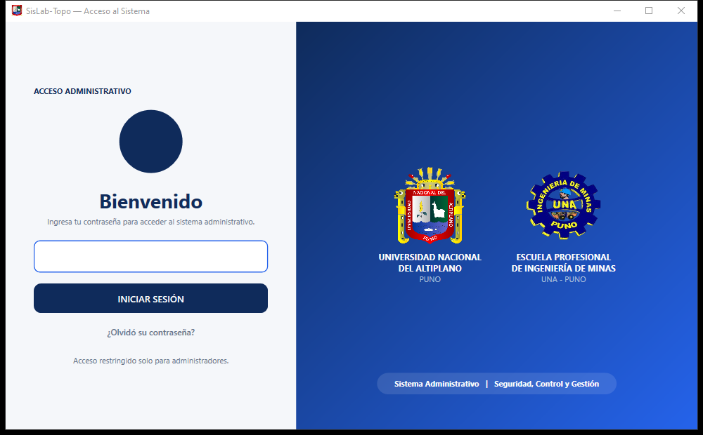
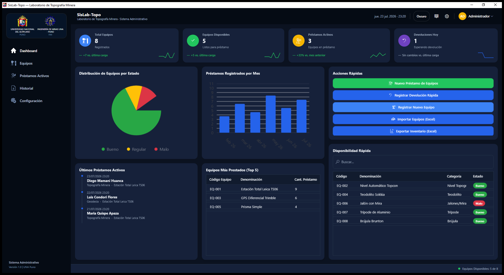
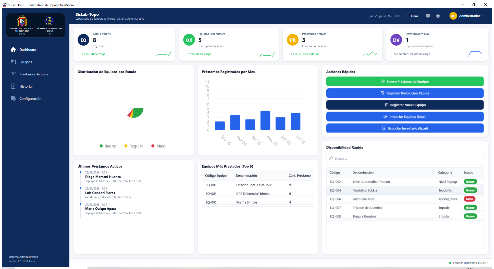
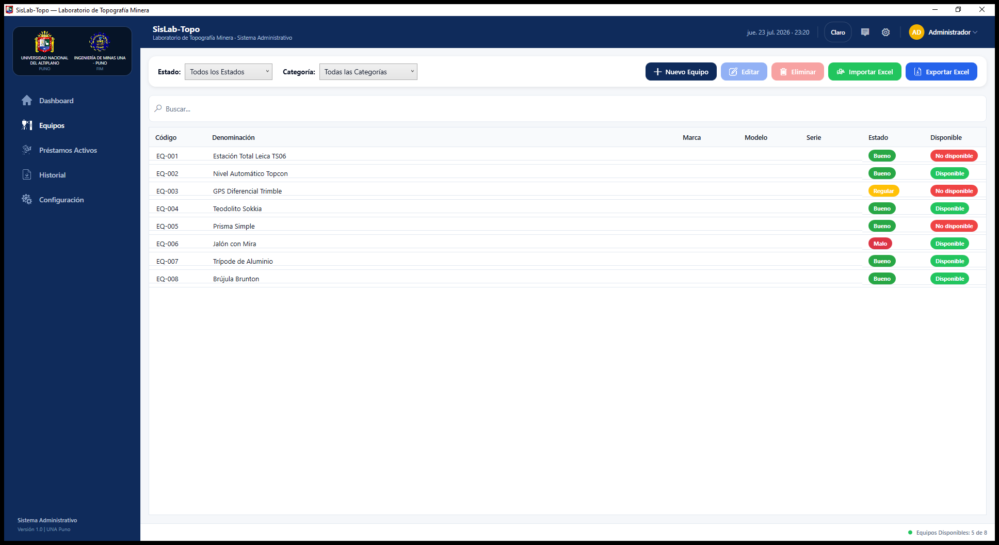
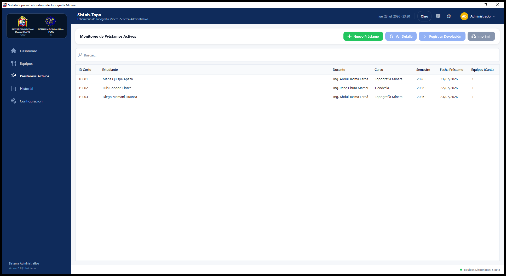

<div align="center">


# SisLab-Topo

**Sistema de Gestión del Laboratorio de Topografía Minera**
Universidad Nacional del Altiplano · Facultad de Ingeniería de Minas

Reescritura completa en **C# / .NET 10 / WPF** del sistema histórico en Java, con arquitectura en capas, base de datos transaccional (SQLite + EF Core) y una interfaz rediseñada desde cero con inspiración Fluent / macOS / Azure Portal.

[](https://github.com/DevChristPhantom/SistemaInvetarioUnap/actions/workflows/ci.yml)
[](https://dotnet.microsoft.com/)
[](#stack-técnico)
[](#pruebas)
[](LICENSE.txt)

</div>

---

## Capturas de pantalla

<table>
<tr>
<td width="50%">

**Inicio de sesión**


</td>
<td width="50%">

**Dashboard — modo oscuro**


</td>
</tr>
<tr>
<td width="50%">

**Dashboard — modo claro**


</td>
<td width="50%">

**Gestión de equipos**


</td>
</tr>
<tr>
<td colspan="2">

**Monitoreo de préstamos activos**


</td>
</tr>
</table>

---

## Acerca del proyecto

SisLab-Topo administra el inventario de equipos topográficos (estaciones totales, niveles, GPS, prismas, etc.) del laboratorio de la Facultad de Ingeniería de Minas: alta de equipos, registro y devolución de préstamos a docentes/estudiantes, historial, reportes en PDF y respaldo del inventario en Excel.

Esta es la migración de la versión original en Java/Swing (que usaba un archivo Excel como base de datos) a una aplicación de escritorio .NET/WPF moderna. El objetivo no fue solo "traducir el código": se aprovechó la migración para cerrar huecos de seguridad reales de la versión anterior y modernizar la interfaz por completo.

**Qué cambió de fondo respecto a la versión Java:**

- **Persistencia real**: SQLite + transacciones (antes: un `.xlsx` que se corrompía si el programa se cerraba a mitad de una escritura).
- **Sin contraseña de fábrica**: un asistente de primer arranque obliga a crear la contraseña de administrador y entrega un código de recuperación de un solo uso (antes: `admin123` hardcodeada y anunciada en el instalador).
- **Bloqueo por intentos fallidos persistente** (antes se olvidaba con solo reiniciar el programa).
- **Interfaz rediseñada**: paleta y componentes con inspiración Fluent / macOS / Azure Portal, modo oscuro con toggle en caliente, sidebar de navegación, dashboard con gráficos y tendencias.
- Reglas de negocio, flujo de trabajo y formato del comprobante en PDF se mantuvieron **1:1** a propósito, para que el cambio de sistema no obligue a reaprender nada.

## Funcionalidades

- 📊 **Dashboard**: KPIs con tendencia y sparkline, distribución de equipos por estado, préstamos por mes, últimos préstamos activos, equipos más prestados, acciones rápidas.
- 🧰 **Equipos**: alta/edición/baja, filtro por estado y categoría, búsqueda, importación y exportación a Excel.
- 📦 **Préstamos**: registro de hasta 6 equipos por transacción, devolución, comprobante en PDF listo para imprimir.
- 🕘 **Historial**: consulta y exportación de préstamos devueltos/vencidos.
- 🌗 **Modo claro / oscuro** en toda la aplicación, con persistencia de preferencia.
- 🔐 **Seguridad**: asistente de primer arranque, bloqueo por intentos fallidos, recuperación de contraseña con código de un solo uso.

## Stack técnico

| Capa | Tecnología |
|---|---|
| UI | WPF (.NET 10), MVVM con [CommunityToolkit.Mvvm](https://github.com/CommunityToolkit/dotnet) |
| Gráficos | [LiveCharts2](https://livecharts.dev/) (SkiaSharp) |
| Datos | SQLite + [Entity Framework Core](https://learn.microsoft.com/ef/core/) |
| Reportes PDF | [QuestPDF](https://www.questpdf.com/) |
| Excel | [ClosedXML](https://github.com/ClosedXML/ClosedXML) |
| Validación | [FluentValidation](https://docs.fluentvalidation.net/) |
| Contraseñas | [BCrypt.Net](https://github.com/BcryptNet/bcrypt.net) |
| Logging | [Serilog](https://serilog.net/) |
| Tests | xUnit + [Moq](https://github.com/devlooped/moq) |
| Instalador | [Inno Setup](https://jrsoftware.org/isinfo.php) |

## Arquitectura

Solución en capas, un proyecto por responsabilidad:

```
src/
├── SisLabTopo.Domain/     # Entidades, enums, excepciones — sin dependencias externas
├── SisLabTopo.Data/       # DbContext (EF Core/SQLite), repositorios, migraciones
├── SisLabTopo.Services/   # Reglas de negocio (equipos, préstamos, auth, reportes)
├── SisLabTopo.Reports/    # Generación de comprobantes en PDF (QuestPDF)
└── SisLabTopo.UI/         # WPF: vistas, ViewModels, temas, navegación

tests/
├── SisLabTopo.Data.Tests/
├── SisLabTopo.Services.Tests/
├── SisLabTopo.Reports.Tests/
└── SisLabTopo.UI.Tests/
```

## Empezando

### Requisitos

- Windows 10/11
- [.NET 10 SDK](https://dotnet.microsoft.com/download)

### Compilar y correr

```bash
git clone https://github.com/DevChristPhantom/SistemaInvetarioUnap.git
cd SistemaInvetarioUnap
dotnet build
dotnet run --project src/SisLabTopo.UI
```

### Pruebas

```bash
dotnet test
```

> 174 pruebas (unitarias + de integración con SQLite en memoria + de renderizado real de WPF) cubriendo dominio, datos, servicios, reportes y ViewModels/vistas. Corren automáticamente en cada push/PR a `main` vía [GitHub Actions](.github/workflows/ci.yml).

### Generar el instalador

```powershell
powershell -ExecutionPolicy Bypass -File installer\publish.ps1
ISCC.exe installer\setup.iss
```

Produce un instalador único y autocontenido (`dist\SisLab-Topo-Setup-x.y.z.exe`, runtime .NET incluido, no requiere instalar nada por separado) mediante [Inno Setup](https://jrsoftware.org/isinfo.php).

#### Firma digital (Authenticode)

El instalador **no está firmado digitalmente todavía**, así que Windows SmartScreen muestra la advertencia estándar de "Editor desconocido" al ejecutarlo (documentado también en el manual de instalación). `installer\sign.ps1` deja el flujo de firma listo y probado:

```powershell
# Prueba local del pipeline (certificado autofirmado de un solo uso -- NO quita SmartScreen)
powershell -ExecutionPolicy Bypass -File installer\sign.ps1 -FilePath dist\SisLab-Topo-Setup-1.0.0.exe -CreateSelfSignedDevCert

# Firma real, una vez que la institución tenga un certificado Authenticode
powershell -ExecutionPolicy Bypass -File installer\sign.ps1 -FilePath dist\SisLab-Topo-Setup-1.0.0.exe -CertPath C:\ruta\certificado.pfx
```

Quitar la advertencia de SmartScreen de verdad requiere que la UNAP compre un certificado Authenticode (OV/EV, ~100-400 USD/año en una CA como DigiCert/Sectigo) o se suscriba a Azure Trusted Signing (~10 USD/mes) — ninguna alternativa gratuita existe, y ambas exigen verificar la identidad de la institución ante el emisor. No es algo que se resuelva con código; el script ya deja todo lo demás (firma + timestamp RFC3161) listo para ese momento.

## Licencia

Uso institucional, Facultad de Ingeniería de Minas — Universidad Nacional del Altiplano. Ver [LICENSE.txt](LICENSE.txt).
